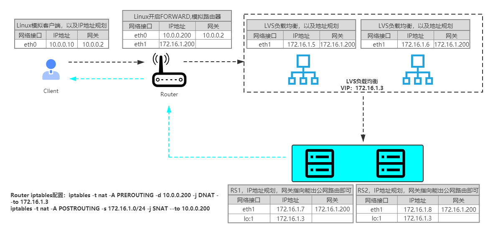

## LVS

### 1 LVS DR模型实践

#### 1.1 DR架构规划



默认10.0.0.0/24为公网地址；172.16.1.0/24为内网地址

#### 1.2 Router配置

eth0：公网IP，网关指向公网网关

eth1：内网IP

开启FORWARD转发功能，实现路由功能

```
echo "net.ipv4.ip_forward = 1" >> /etc/sysctl.conf
```

配置防火墙规则：

```
iptables -t nat -A PREROUTING -d 10.0.0.200 -j DNAT --to 172.16.1.3
iptables -t nat -A POSTROUTING -s 172.16.1.0/24 -j SNAT --to 10.0.0.200
```


#### 1.3 DS(LVS服务器)配置

DS为两台LVS服务器，使用keepalived实现高可用。VIP172.16.1.3绑定到eth1网卡上

DS1：

​		IP：172.16.1.5，网关指向路由内网IP172.16.1.200

​		keepalived配置：	

```
global_defs {
    router_id proxy01
}
vrrp_script check_nginx {
    script "/data/apps/scripts/check_nginx.sh"
    interval 5
}
vrrp_instance VI_1 {
    state MASTER
    interface eth1
    virtual_router_id 50
    priority 150
    advert_int 1
    authentication {
        auth_type PASS
        auth_pass 1111
    }
    virtual_ipaddress {
        172.16.1.3
    }
    track_script {
        check_nginx
    }
}
```

DS2：

​		IP：172.16.1.6，网关指向路由内网IP172.16.1.200

​		keepalived配置：

```shell
global_defs {
    router_id proxy02
}
vrrp_script check_nginx {
    script "/data/apps/scripts/check_nginx.sh"
    interval 5
}
vrrp_instance VI_1 {
    state BACKUP
    interface eth1
    virtual_router_id 50
    priority 100
    advert_int 1
    authentication {
        auth_type PASS
        auth_pass 1111
    }
    virtual_ipaddress {
        172.16.1.3
    }
}
```

DS节点负载均衡配置

* 定义LVS集群

  ```
  ipvsadm -C
  ipvsadm -A -t 172.16.1.3:80 -s rr
  ```

* 添加RS1、RS2集群节点，采用DR模型

  ```
  ipvsadm -a -t 172.16.1.3:80 -r 172.16.1.7:80 -g
  ipvsadm -a -t 172.16.1.3:80 -r 172.16.1.8:80 -g
  ```

#### 1.4 RS配置

RS1：

​		eth0网卡IP：172.16.1.7，网关指向路由内网IP172.16.1.200

​		VIP172.16.1.3绑定到lo网卡

RS1：

​		eth0网卡IP：172.16.1.8，网关指向路由内网IP172.16.1.200

​		VIP172.16.1.3绑定到lo网卡

两台机器都需要配置arp，不对外宣告本机VIP地址，也不响应其他节点发起ARP请求本机的VIP

```
echo "net.ipv4.conf.lo.arp_ignore=1
net.ipv4.conf.lo.arp_announce=2
net.ipv4.conf.all.arp_ignore=1
net.ipv4.conf.all.arp_announce=2" >> /etc/sysctl.conf
```

