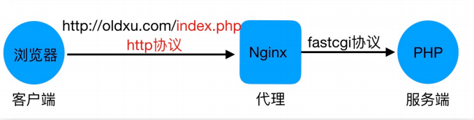
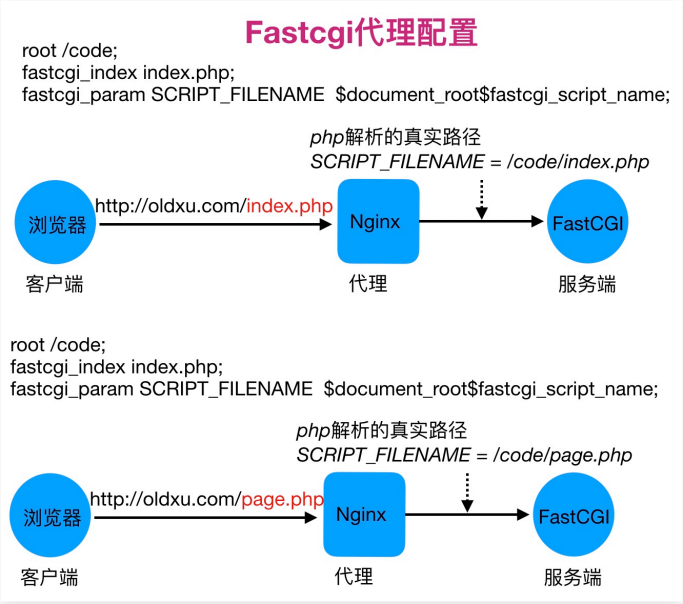

# 1 Nginx基础Http协议

##  1.1 Http工作原理

> 
>
> 在用户点击URL为http://www.qq.com/index.html的链接后，浏览器和web服务器执行以下动作：
>
> 1. 浏览器分析超链接中的URL
> 2. 浏览器向DNS请求解析www.qq.com的IP地址
> 3. DNS将解析出的IP地址返回给浏览器
> 4. 浏览器域服务器建立TCP链接        
> 5. 浏览器请求文档：GET /index.html
> 6. 服务器给出响应，将文档index.html发送给浏览器
> 7. 释放TCP链接
> 8. 浏览器显示index.html中的内容                                                                                                             

## 1.2 Http请求Request

### 1.2.1 请求Method

- 客户端向服务端发送请求时，会根据不同的资源发送不同的请求方法Method：
  - GET：用于获取URI对应的资源；（比如看朋友圈）
  - POST：用于提交请求，可以更新或者创建资源，是非幂等的；（发布朋友圈）
  - PUT：用于向指定的URI传送更新资源，是幂等的；（更新朋友圈）
  - DELETE：用于向指定的URI删除资源；（比如删朋友圈）
  - HEAD：用于检查
- 一般创建对象时用POST，更新对象时用PUT；
  - PUT是幂等的，POST是非幂等的；
  - 幂等：对于相同的输入，每次得到的结果都是相等的

### 1.2.2响应Status

http响应状态码Status-Code以3位数字组成，用来标识该请求是否成功，比如是正常还是错误等，HTTP/1.1中状态码可以分为五大类

| 状态码 | 说明                                           |
| ------ | ---------------------------------------------- |
| 1xx    | 信息，服务器收到请求，需要请求者继续执行操作   |
| 2xx    | 成功，操作被成功接收并处理                     |
| 3xx    | 重定向，需要进一步的操作以完成请求             |
| 4xx    | 客户端错误，请求包含语法错误或无法完成请求     |
| 5xx    | 服务器错误，服务器在处理请求的过程中发生了错误 |

# 2 Nginx Web快速入门

## 2.1 Nginx虚拟主机

Nginx配置虚拟主机有如下三种方式：

- 基于主机多IP方式

  

- 基于端口的配置方式

  

- 基于多个hosts名称方式（多域名方式）

  

# 3 Nginx常用模块

## 3.1 Nginx目录索引

当ngx_http_index_module模块找不到索引文件时，通常会将请求传递给ngx_http_autoindex_module模块

ngx_http_autoindex_module模块处理以斜杠字符结尾的请求，并生成目录列表

### 3.1.1 ngx_http_autoindex_module场景示例：

模拟搭建企业内部yum仓库

```
server {
	listen	80;
	server_name	mirror.micah.com;
	root /mirror;
	charset	uft-8;		#设定字符集，防止中文字符乱码
	
	location / {
		index index.html;
	} 
	
	location /repo {
		autoindex	on;		#启用目录列表输出
		autoindex_exact_size	off;	#是否在目录列表中输出确切的文件大小，on显示字节，off显示大概单位
		autoindex_localtime	on;		#是否显示本地时间，on本地时区，off UTC时间
	}
}
```

## 3.2 Nginx访问控制

ngx_http_access_module模块允许限制对某些客户端地址的访问

### 3.2.1 ngx_http_access_module场景示例：

只允许指定的来源IP访问/centos，其他网段拒绝

```
server {
	listen	80;
	server_name	mirror.micah.com;
	charset	utf-8;
	autoindex	on;		#启用目录列表输出
	autoindex_exact_size	off;	#是否在目录列表中输出确切的文件大小，on显示字节，off显示大概单位
	autoindex_localtime	on;
	
	location / {
		index index.html;
	}
	
	location /centos {
		allow 127.0.0.1;
		allow 10.0.0.1/24;	#允许地址或网段
		deny all;			#拒绝所有人
	}
}
```

ngx_http_auth_basic_module模块允许使用http基本身份验证，验证用户名和密码来限制对资源的访问

### 3.2.2 ngx_http_auth_basic_module场景示例

基于用户名和密码认证实践

```
server {
	listen	80;
	server_name mirror.micah.com;
	charset	utf-8;
	autoindex	on;		#启用目录列表输出
	autoindex_exact_size	off;	#是否在目录列表中输出确切的文件大小，on显示字节，off显示大概单位
	autoindex_locatime	on;
	
	location / {
		index index.html;
	}
	
	location /centos {
		auth_basic "Auth access Blog Input your Passwd!";
        auth_basic_user_file /etc/nginx/auth.passwd;	#账号密码文件
	}
}
```

## 3.3 Nginx限流限速

### 3.3.1 场景一：综合案例

限制web服务器请求数处理为1秒一个，触发值为5，限制用户尽可同时下载一个文件。当下载超过100M则现在下载速度为500k。如果同时下载超过2个视频，则返回提示“请进行会员充值”

```
limit_req_zone $binary_remote_addr zone=req_mg:10m rate=1r/s;
#$binary_remote_addr表示通过这个标识来做限制，限制同一客户端ip地址
#zone=req_one:10m表示生成一个大小为10m，名为req_one的内存区域，用来存储访问的频次信息#rate=1r/s表示允许相同标识的客户端的访问频次，这里限制的是每秒1次

limit_conn_zone $binary_remote_addr zone=conn_mg:10m;
    
server {
	listen 80;
	server_name	mirror.micah.com;
	root /code;
	charset utf-8;
	autoindex	on;	
	autoindex_exact_size	off;
	autoindex_locatime	on;
	
	limit_req zone=req_one burst=5 nodelay;
	#zone=req_one设置使用哪个配置区域来做限制，与上面limit_req_zone里面的name对应
	#burst=5,设置一个大小为5的缓冲区，当有大量请求过来时，超过了访问频次限制的请求可以先放到这个缓冲区内
	#nodelay，超过访问频次并且缓冲区也满了的时候，则会返回503，如果没有设置，则所有请求会等待排队
	
	limit_conn conn_mg 1;
	limit_rate_after 100m;
	limit_rate 500k; 
	
	error_page 503 @errpage;
	location @errpage {
		default_type text/html;
		return 200 "请进行会员充值"
	}
	location / {
		index index.html;
	}
}
```

## 3.4 Nginx状态监控

ngx_http_stub_status_module模块提供对基本状态信息的访问

配置示例：

```
server {
	listen 80;
	server_name mirror.micah.com;
	
	location /nginx_status {
		stub_status;
	}
}
```

状态信息含义：

| 状态               | 含义                                  |
| ------------------ | ------------------------------------- |
| Active connections | 当前活跃连接数，包含waiting等待连接数 |
| accepts            | 已接受的总TCP连接数量                 |
| handled            | 已处理的TCP连接数量                   |
| requests           | 当前总http请求数量                    |
| Reading            | 当前读取的请求头数量                  |
| Writing            | 当前响应的请求头数量                  |
| Waiting            | 当前等待请求的空闲客户端连接数        |

## 3.5 Nginx Location

### 3.5.1 Location语法

```
location [ = | ~ | ~* |^~ ] uri { ... }
location @name { ... }
```

| 匹配符 | 匹配规则                     | 优先级 |
| ------ | ---------------------------- | ------ |
| =      | 精确匹配                     | 1      |
| ^~     | 以某个字符串开头             | 2      |
| ~      | 区分大小写的正则匹配         | 3      |
| ~*     | 不区分大小写的正则匹配       | 4      |
| /      | 通用匹配，任何请求都会匹配到 | 5      |

# 4 Nginx搭建流行架构

## 4.1 LNMP架构基本概述

### 4.1.1 LNMP实现过程



 ## 4.2 LNMP架构环境配置

### 4.2.1 图形展示fastcgi_index与fastcgi_param作用



##### 4.2.2 Nginx与PHP集成

示例配置文件

```
server {
	server_name	php.micah.com;
	listen 80;
	root /code;
	index index.php index.html;
	
	location ~ \.php$ {
		fastcgi_pass 127.0.0.1:9000;
		fastcgi_param SCRIPT_FILENAME $document_root$fastcgi_script_name;
		include	fastcgi_params;
	}
}
```

# 5 Nginx反向代理服务

正向代理与反向代理区别：

区别在于形式上服务的“对象”不一样，其次架设的位置点不一样

正向代理代理的对象是客户端，为客户端服务

反向代理代理的对象是服务端，为服务端服务

## 5.1 Nginx代理服务支持协议

1、Nginx作为代理服务，支持的代理协议非常的多，具体如下图


2、通常情况下，我们将Nginx作为反向代理，常常用到如下几种协议：


## 5.2 Nginx代理网站优化配置项

```
vim /etc/nginx/proxy_params
proxy_http_version 1.1;
proxyy_set_header Host $http_host;
proxy_set_header X-Real-IP $remote_addr;
proxy_set_header X-Forwarded-For $proxy_add_x_forwarded_for;
proxy_connect_timeout  30;
proxy_send_timeout 60;
proxy_read_timeout 60;
proxy_buffering on;
proxy_buffer_size 64k;
proxy_buffers 4 64k;

location / {
	proxy_pass http://127.0.0.1:8080;
	include	proxy_params;
}
```

# 6 Nginx七层负载均衡

## 6.1 Nginx负载均衡基本概述

### 6.1.1 负载均衡与代理区别

* Nginx负载均衡与Nginx反向代理不同地方在于：
  * Nginx代理仅代理一台服务器
  * Nginx负载均衡则是将客户端请求通过proxy_pass代理至一组upstream资源池

## 6.2 Nginx负载均衡应用场景

### 6.2.1 四层与七层区别

* 四层负载均衡：传输层
  * 优点：性能高，数据包在底层就进行了转发
  * 缺点：仅支持ip:port转发，无法完成复杂的业务逻辑应用
* 七层负载均衡：应用层
  * 优点：贴近业务，支持URI路径匹配、Header改写、Rewrite等
  * 缺点：性能低，数据包需要拆解到顶层才进行转发

## 6.3 Nginx负载均衡配置场景

* Nginx实现负载均衡需要两个模块：
  * proxy_pass：代理模块
  * upstream：虚拟资源池模块

配置示例：

```
upstream backend {
	server backend1.example.com weight=5;
	server backend2.example.com:8080;
	server unix:/tmp/backend3;
	server backup1.example.com:8080	backup;
}
server {
	location / {
	proxy_pass http://backend;
	}
}
```

## 6.4 Nginx负载均衡调度算法

| 调度算法   | 概述                                                         |
| ---------- | ------------------------------------------------------------ |
| 轮询       | 按时间顺序逐一分配到不同的后端服务器（默认）                 |
| weight     | 加权轮询，weight值越大，分配到的访问几率越高                 |
| ip_hash    | 每个请求按访问IP的hash结果分配，这样来自同一IP的固定访问一个后端服务器 |
| least_conn | 将请求传递到活动连接数最少的服务器                           |

**backup标识备份状态**

backup将服务器标记为备份服务器。当主服务器不可用时，将请求传递至备份服务器处理

