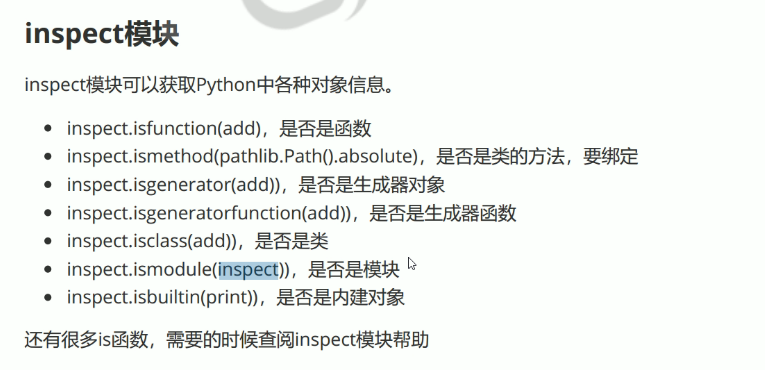

#### 无参装饰器

@logger

```python
import time
import datetime
from functools import update_wrapper
def logger(wrapped):
    def wrapper(*args, **kwargs):
        start = datetime.datetime.now()
        ret = wrapped(*args, **kwargs)
        print("程序运行时间：{}s".format((datetime.datetime.now() - start).total_seconds()))
        return ret
    update_wrapper(wrapper, wrapped)
    return wrapper
              
@logger    # add = logger(add),logger等效为单参函数
def add(x, y):
    """
    加法运算
    参数x, y
    返回x + y
    """
    time.sleep(2)
    return x + y
              
add(4, 5)
print(add.__name__, add.__doc__)
```

#### 带参装饰器

@wraps(wrapped)

```python
import time
import datetime
from functools import update_wrapper, wraps
def logger(wrapped):
    @wraps(wrapped)  # wrapper = wraps(wrapped)(wrapper)
    def wrapper(*args, **kwargs):
        start = datetime.datetime.now()
        ret = wrapped(*args, **kwargs)
        print("程序运行时间：{}s".format((datetime.datetime.now() - start).total_seconds()))
        return ret
#     update_wrapper(wrapper, wrapped)
    return wrapper
              
@logger    # add = logger(add),logger等效为单参函数
def add(x, y):
    """
    加法运算
    参数x, y
    返回x + y
    """
    time.sleep(2)
    return x + y
              
add(4, 5)
print(add.__name__, add.__doc__)
```

### 注解

#### 函数注解

```python
def add(x:int, y:int) -> list:
    return x + y
print(add.__annotations__) 
```

#### 类型注解

```python
i:int = 3
j:str = 'abc'
k:str = 300
```

#### inspect模块



参数类型注解：

```python
from functools import update_wrapper, wraps
import inspect

def checkParams(fn):
    @wraps(fn)   # wrapper = wraps(fn)(wrapper)
    def wrapper(*args, **kwargs):
        params = inspect.signature(fn).parameters
        print(args, kwargs, params)
        for k, v in zip(args, params.values()):
            if v.annotation != v.empty and not isinstance(k, v.annotation):
                print("{} = {} type is not OK ,args".format(v.name, k))
        for k, v in kwargs.items():
            if params[k].annotation !=  params[k].empty and not isinstance(v, params[k].annotation):
                print("{} = {} type is not OK ,kwargs".format(params[k].name, v))
        ret = fn(*args, **kwargs)
        return ret
    return wrapper
   
@checkParams  # add = checkParams(add)
def add(x:int, y:int) -> int:
    print(x, y)
#     return x + y

add(4, y = '5')
```

